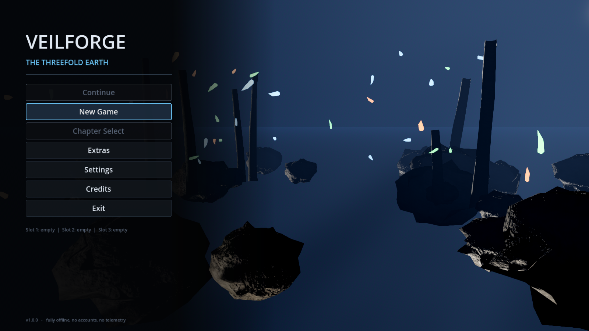
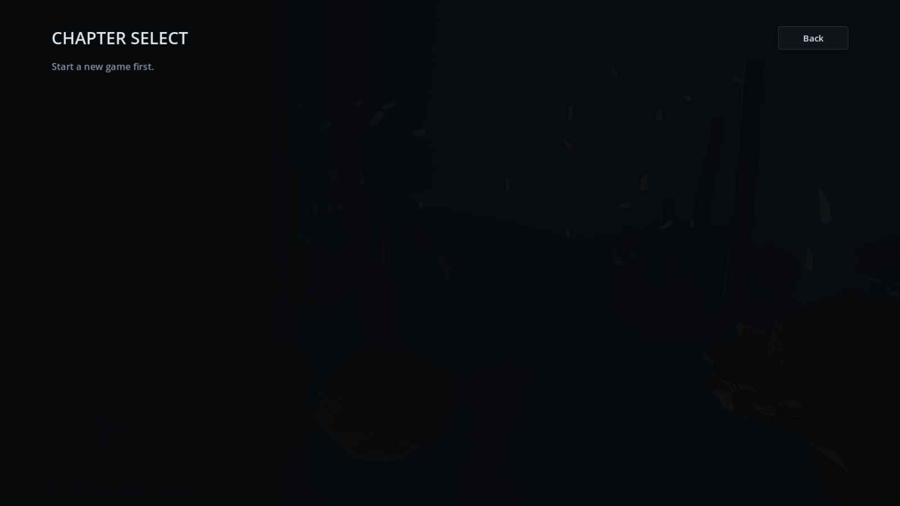
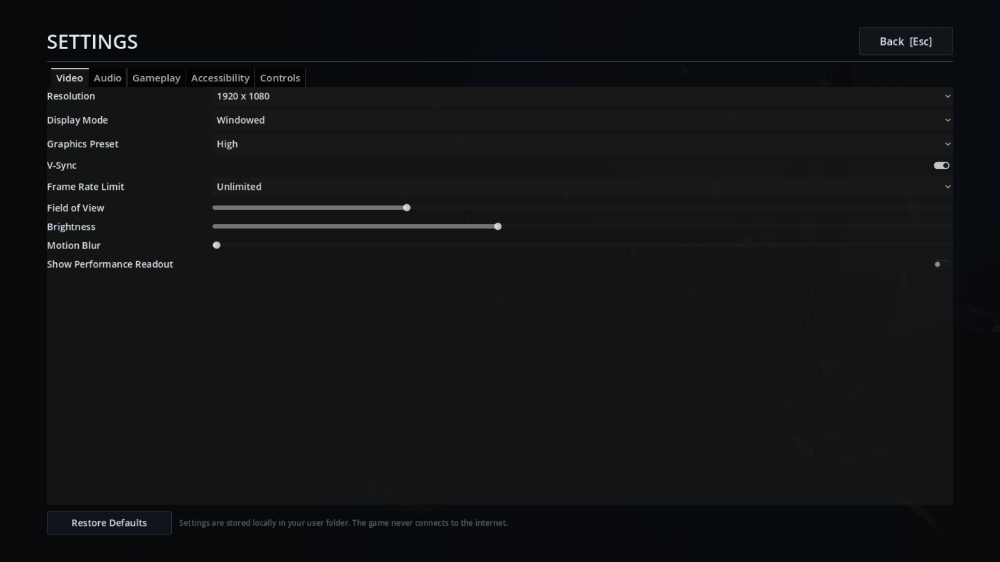
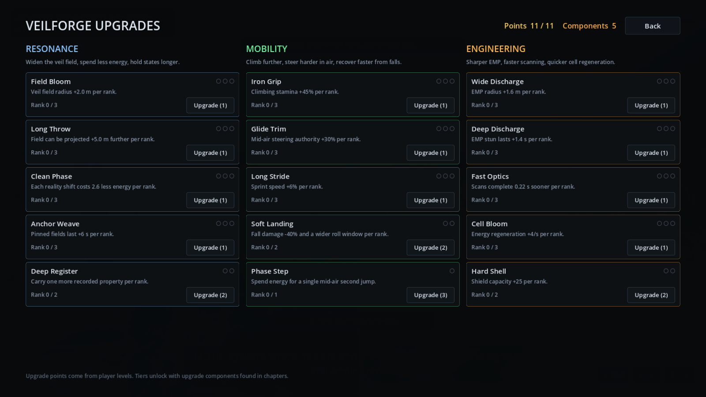
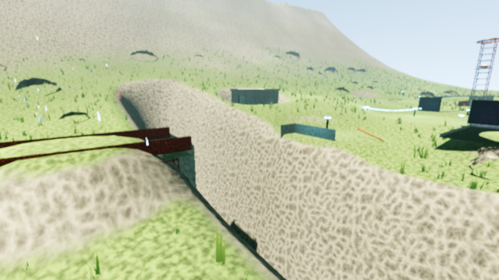
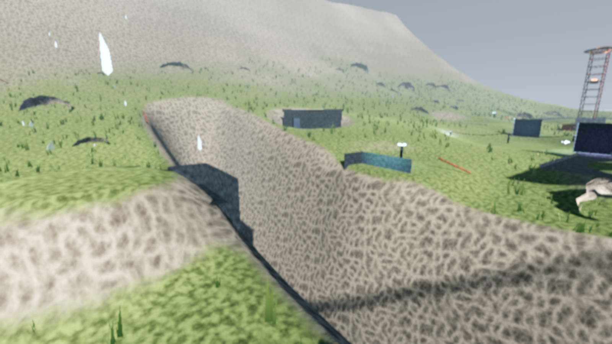
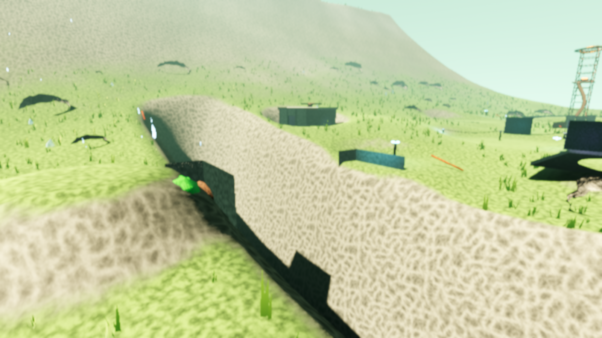
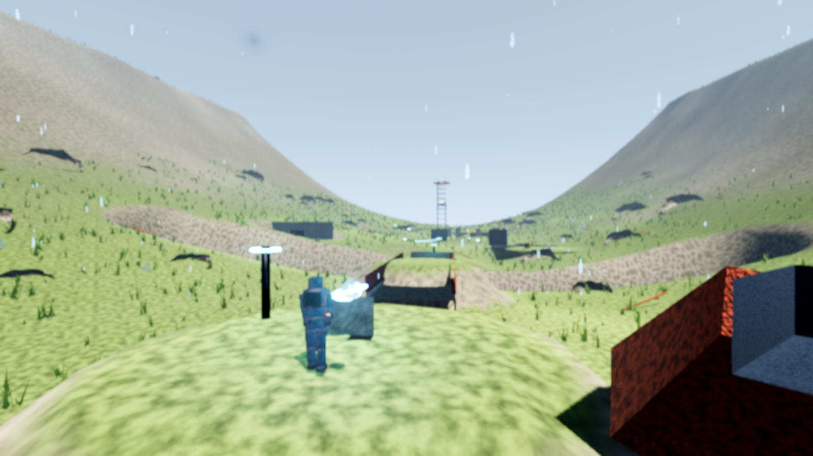
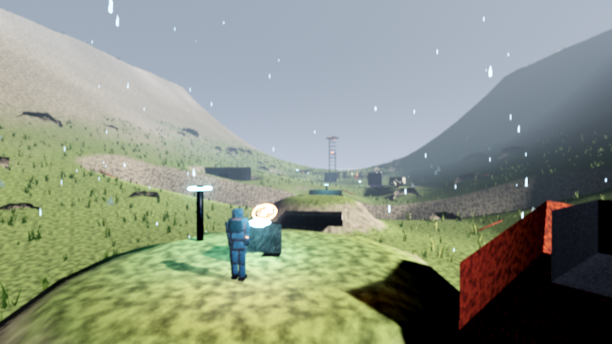
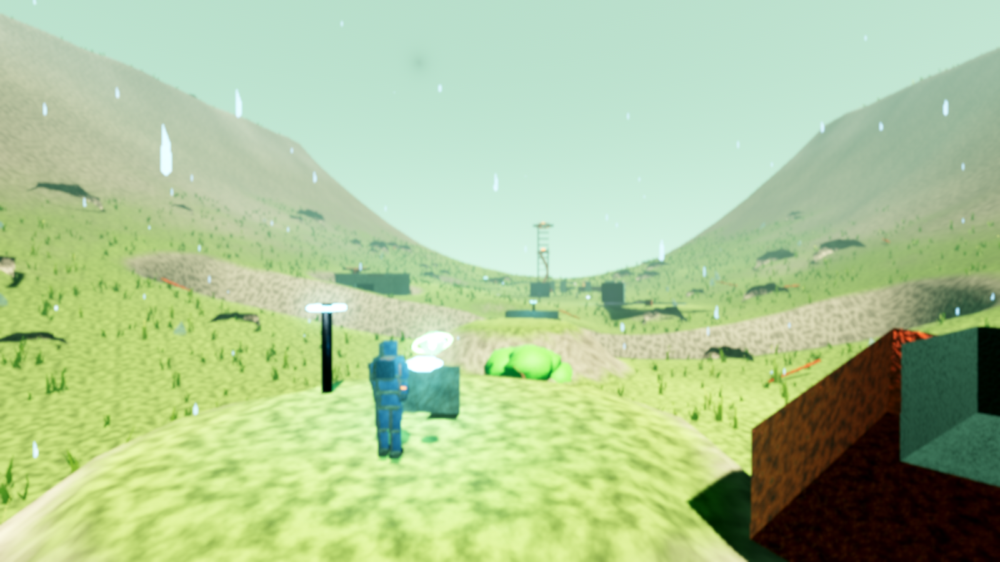

# VEILFORGE: THE THREEFOLD EARTH

A single-player 3D exploration and reality-manipulation game for Windows PC.

After a planetary event called **the Fracture**, every location exists in three
physical versions at once — **Memory** (before the damage), **Ruin** (the
present) and **Bloom** (a future reclaimed by vegetation). You are a survey
engineer carrying the Veilforge Device, accompanied by a floating survey drone
called MOTE. The Device projects a movable field that shifts everything inside
it between the three states, changing geometry, collision, materials, lighting,
weather, hazards, machine behaviour and audio — and therefore changing which
routes exist and which puzzles are solvable.

Eight chapters, roughly 2–3 hours for a first playthrough.

**Completely offline.** No accounts, no servers, no telemetry, no advertising,
no microtransactions, no loot boxes. The game opens no sockets of any kind.

---

## Screenshots

| | |
| --- | --- |
|  |  |
|  |  |

The same fissure in Chapter 1, in all three realities. The Memory span is a
surface you walk on; in Ruin it is not there at all, and the collision goes with
it. This is the whole game in one row:

| Memory | Ruin | Bloom |
| --- | --- | --- |
|  |  |  |
|  |  |  |

Captured from the running game with `--autotest --shots` on a software Vulkan
rasteriser, so these are dimmer and softer than the same frames on a real GPU.

---

## Running the game (Windows)

1. Unzip `VEILFORGE-Windows-x86_64.zip` anywhere you like.
2. Run `VEILFORGE.exe`.

There is no installer and no launcher. The executable has the whole game
embedded in it. First launch creates a save folder at:

```
%APPDATA%\Godot\app_userdata\VEILFORGE - THE THREEFOLD EARTH\
```

which holds `settings.cfg`, `saves\slot_1..3.json` and a local `veilforge.log`.
Deleting that folder resets the game to a fresh install.

### Minimum / recommended

|              | Minimum                          | Recommended                     |
| ------------ | -------------------------------- | ------------------------------- |
| OS           | Windows 10 64-bit                | Windows 10/11 64-bit            |
| CPU          | 4 cores, 2.5 GHz                 | 6 cores, 3.5 GHz                |
| RAM          | 4 GB                             | 8 GB                            |
| GPU          | Vulkan 1.1, 2 GB (GTX 1050 tier) | Vulkan 1.2, 6 GB (RTX 2060 tier)|
| Storage      | 250 MB                           | 250 MB                          |
| Preset       | Low / Medium at 1080p            | High at 1080p, 60 FPS           |

The renderer is Godot's Forward+ (Vulkan). A Vulkan-capable GPU is required.

If the game will not start on an older GPU, run it with the compatibility
renderer:

```
VEILFORGE.exe --rendering-method gl_compatibility
```

Visual quality drops (no SDFGI, no volumetric fog, no SSR) but the game is fully
playable.

---

## Building from source

The editable Godot project is in `project/`.

### Requirements

* **Godot 4.3 stable** (standard build, not .NET) — <https://godotengine.org>
* Godot **export templates for 4.3 stable**, installed via
  *Editor → Manage Export Templates → Download and Install*.

No other dependencies. There is nothing to `npm install`, no asset packs to
fetch, and no build step beyond Godot's own export.

### Open in the editor

```
godot --path project
```

The first open imports the project and builds the script class cache.

### Export a Windows build

From the repository root:

```
tools/build_windows.sh          # Linux/macOS host
tools\build_windows.bat         # Windows host
```

or directly:

```
godot --headless --path project --export-release "Windows Desktop" \
      ../release/VEILFORGE/VEILFORGE.exe
```

The preset embeds the PCK into the executable, so the output is a single
self-contained `VEILFORGE.exe`. `tools/build_windows.sh` also writes the
distributable ZIP to `release/`.

### Run the automated test suite

```
godot --headless --path project -- --autotest --chapters=1,2,3,4,5,6,7,8
```

This drives the real game: it loads each chapter, moves the player with real
input, fires the Device, shifts states, scans, imprints, kills and respawns the
player, stuns guardians, solves every puzzle and completes each chapter, then
prints a pass/fail line per check and exits non-zero on any failure. A report is
also written to `user://autotest_report.txt`.

Optional flags:

* `--quick` — load one chapter and report live memory while playing it
* `--shots` — render each chapter from fixed vantage points in all three
  reality states and save PNGs to `user://shots/` (needs a display or Xvfb)
* `--skip=hud,weather,...` — disable subsystems, used for bisecting

The harness lives in `project/tests/` and is **excluded from release exports**,
so a shipped build has no way to reach it.

---

## Repository layout

```
project/                 Godot 4.3 project (the editable game)
  autoload/              Singletons: settings, saves, progression, audio, assets
  core/                  Gameplay systems
    veil/                Reality states: subjects, manager, field, device
    player/              Controller, camera, procedural character
    ai/                  Guardians and MOTE
    puzzle/              Pressure plates, power nets, conduits, locks, prisms
    world/               Terrain, atmosphere, weather, water, chapter framework
    util/                Constants, tuning, chapter database
  chapters/              Chapter01..Chapter08 - the levels, as code
  ui/                    HUD, menus, settings, upgrades, records, results
  scenes/                Boot, MainMenu, Game
  shaders/               Terrain, wind-reactive vegetation, water
  tests/                 Automated playtest harness (dev only)
release/                 Packaged Windows build and distributable ZIP
tools/                   Build scripts
docs/                    Captured screenshots
```

## Documentation

* [CONTROLS.md](CONTROLS.md) — full control reference, keyboard and controller
* [GAME_DESIGN.md](GAME_DESIGN.md) — mechanics, chapter breakdown, progression
* [TECHNICAL_ARCHITECTURE.md](TECHNICAL_ARCHITECTURE.md) — how it is built
* [QA_REPORT.md](QA_REPORT.md) — what was tested and what the results were
* [KNOWN_LIMITATIONS.md](KNOWN_LIMITATIONS.md) — honest list of what is weak
* [THIRD_PARTY_LICENSES.md](THIRD_PARTY_LICENSES.md) — engine licence and asset provenance
